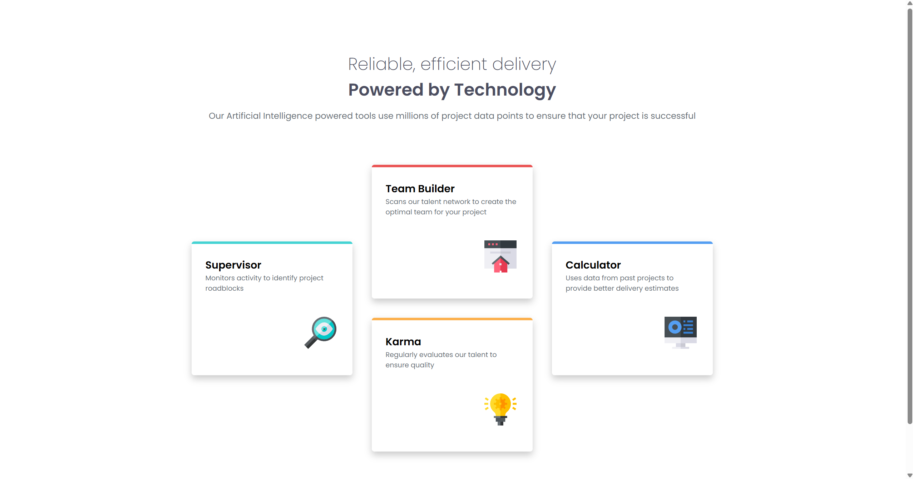
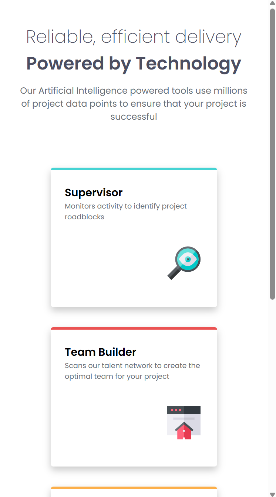

# Frontend Mentor - Four card feature section solution

This is a solution to the [Four card feature section challenge on Frontend Mentor](https://www.frontendmentor.io/challenges/four-card-feature-section-weK1eFYK). Frontend Mentor challenges help you improve your coding skills by building realistic projects.

## Table of contents

- [Overview](#overview)
  - [The challenge](#the-challenge)
  - [Screenshot](#screenshot)
  - [Links](#links)
- [My process](#my-process)
  - [Built with](#built-with)
  - [What I learned](#what-i-learned)
- [Author](#author)

## Overview

### The challenge

Users should be able to:

- View the optimal layout for the site depending on their device's screen size

### Screenshots

**Desktop:**


**Mobile:**


### Links

- Solution URL: [https://www.frontendmentor.io/solutions/four-card-feature-section-with-css-grid-and-clamp-function-JyZpwxEOVF](https://www.frontendmentor.io/solutions/four-card-feature-section-with-css-grid-and-clamp-function-JyZpwxEOVF)
- Live Site URL: [https://ryyhardy.github.io/frontend-mentor-four-card-feature-section/](https://ryyhardy.github.io/frontend-mentor-four-card-feature-section/)

## My process

### Built with

- Semantic HTML5 markup
- Flexbox
- CSS Grid
- Mobile-first workflow

### What I learned

I was rusty because I haven't done these challenges in a while, but luckily I breezed through the HTML side of things. I am not going to try and force-use the figure element again (lol).

I got a lot of good practice with CSS grid and getting that to work with the sort-of
"staggered" grid design.

Like always, I had to fight a lot with units, especially for the font size. One issue
I had was that for the media query, the font would look good on mobile, but it would be too large just after the transition, before slowly going back to normal for larger desktop sizes.

I heard that this is actually a common issue with that "awkward in-between zone" when the font size is not right after a layout shift.

To solve that, I used the `clamp()` function, which is something I definitely want to use more because it is insanely powerful. The only problem is that I don't really have the intuition for it yet. I basically had to do trial and error with different units in the 3 parameters over and over again until I found something that worked. It was very hard.

Like always, I am open to feedback/advice anywhere, but especially those two struggles I mentioned.

Here is the media query I mentioned (with the `clamp()` function on the cards):

```css
@media only screen and (min-width: 600px) {
  body {
    display: grid;
    place-content: center;
  }

  .gallery {
    display: grid;
    grid-template-columns: repeat(3, 1fr);
    max-width: 1000px;
  }

  .gallery-card {
    font-size: clamp(0.5em, 1vw, 80%);
  }

  .supervisor {
    grid-column: 1;
    grid-row: 1 / span 2;
  }

  .calculator {
    grid-column: 3;
    grid-row: 1 / span 2;
  }
}
```

## Author

- GitHub - [ryyHardy](https://github.com/ryyHardy)
- Frontend Mentor - [@ryyHardy](https://www.frontendmentor.io/profile/ryyHardy)
